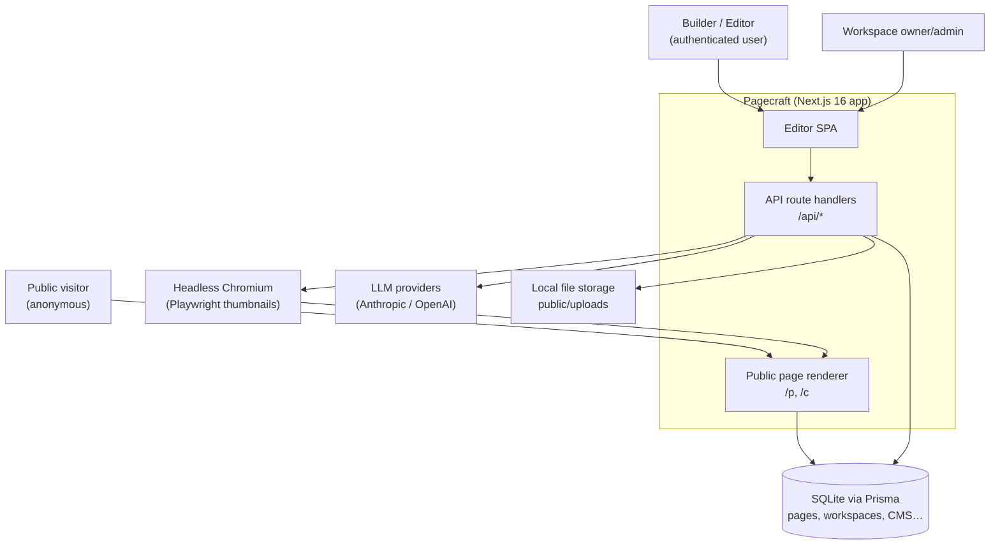
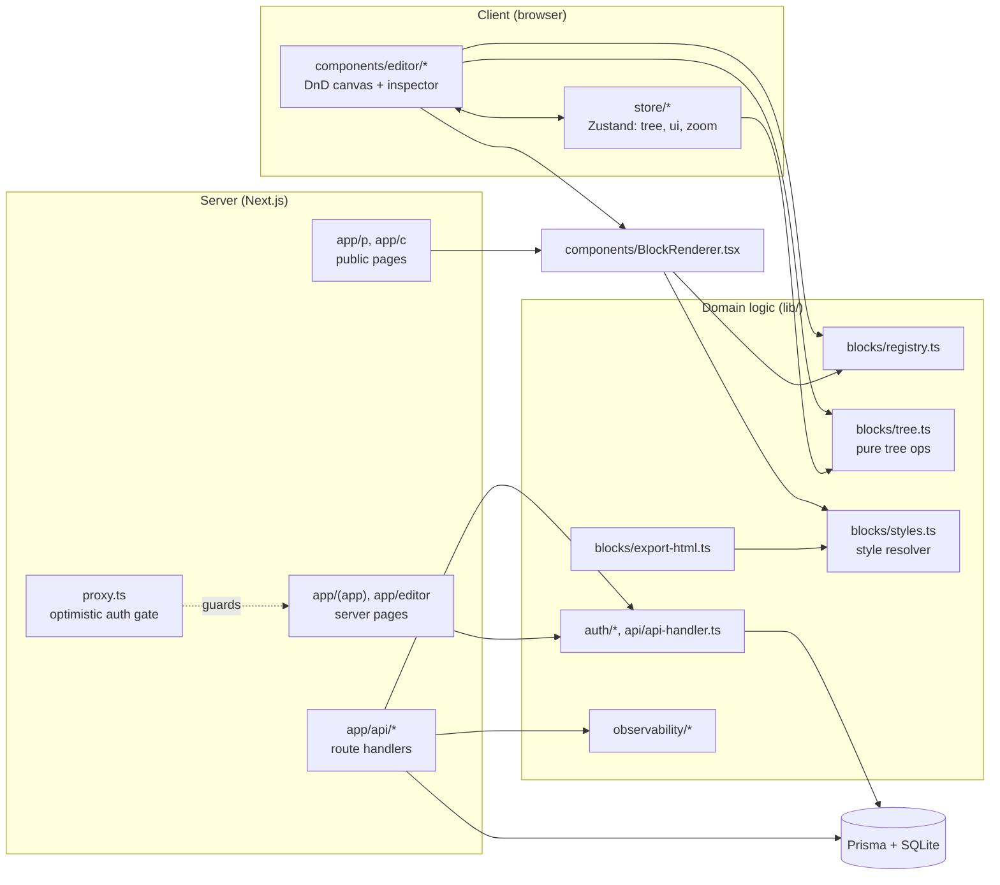
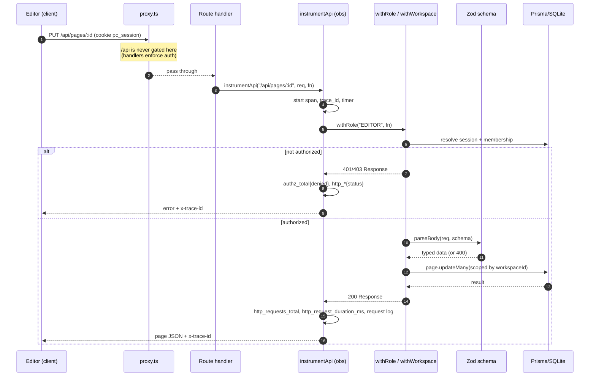
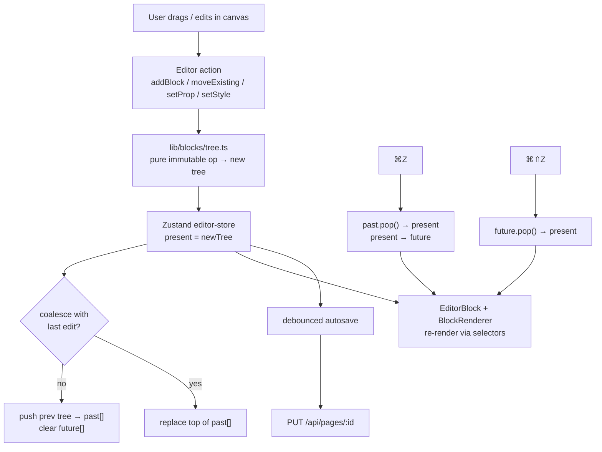
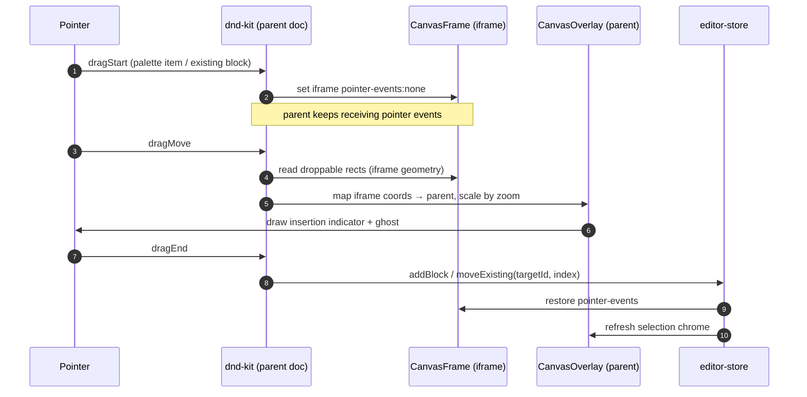
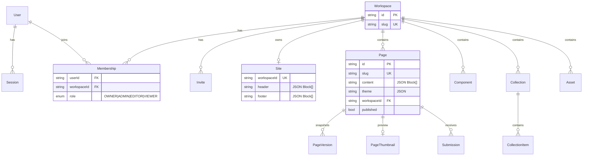
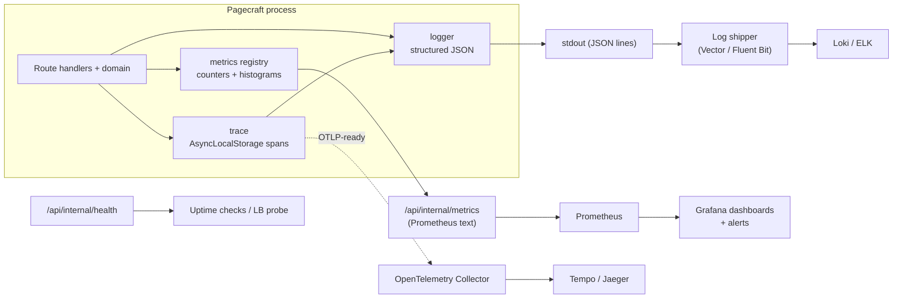
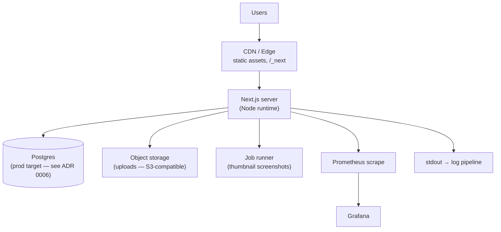

# Pagecraft — Architecture Diagrams

Visual companion to the [Architecture Decision Records](./adr/README.md). All
diagrams are [Mermaid](https://mermaid.js.org) so they render on GitHub and in
most Markdown viewers. For a whiteboard-style version, the same models import
cleanly into [Excalidraw](https://excalidraw.com) via its Mermaid-to-Excalidraw
feature.

---

## 1. System context (C4 level 1)

How the system sits between its users and the outside world.

---

## 2. Container / module view

The major code areas and how they depend on each other. Mirrors ADRs
[0001](./adr/0001-next-app-router-react-19.md)–[0011](./adr/0011-vitest-no-eslint.md).

---

## 3. Request lifecycle — authenticated API call

End-to-end path of an autosave `PUT /api/pages/:id`, including the two-layer auth
([ADR 0008](./adr/0008-cookie-session-auth-proxy-gate.md)) and observability
([ADR 0010](./adr/0010-zod-guarded-api-handlers.md)).

---

## 4. Editor data flow — block tree, state, undo/redo

How a drag/edit mutates state ([ADR 0002](./adr/0002-recursive-json-block-tree.md),
[ADR 0004](./adr/0004-zustand-immutable-tree-undo-redo.md)).

---

## 5. Drag-and-drop across the iframe boundary

The most intricate piece ([ADR 0005](./adr/0005-dnd-kit-iframe-canvas.md)):
content lives in an iframe, chrome lives in the parent, coordinates are mapped
and zoom-scaled.

---

## 6. Data model (ER)

Tenant-scoped relational core + JSON document columns
([ADR 0006](./adr/0006-prisma-sqlite-json-columns.md),
[ADR 0007](./adr/0007-workspace-multitenancy.md)).

---

## 7. Observability pipeline

What the app emits and where it goes
([details](./observability.md)).

---

## 8. Deployment topology (target)

> The current dev stack runs everything in one Node process with SQLite and the
> local filesystem. The boxes above are the production-shaped targets the code is
> structured to grow into (Prisma provider swap, pluggable storage, externalized
> screenshot job).
